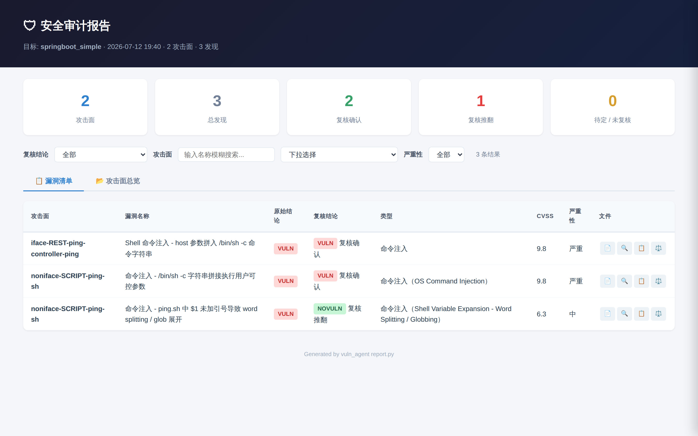
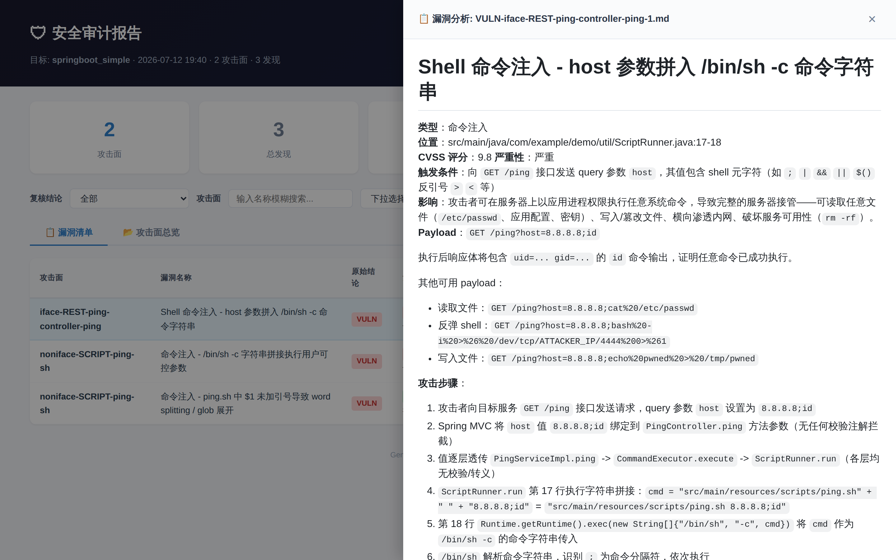
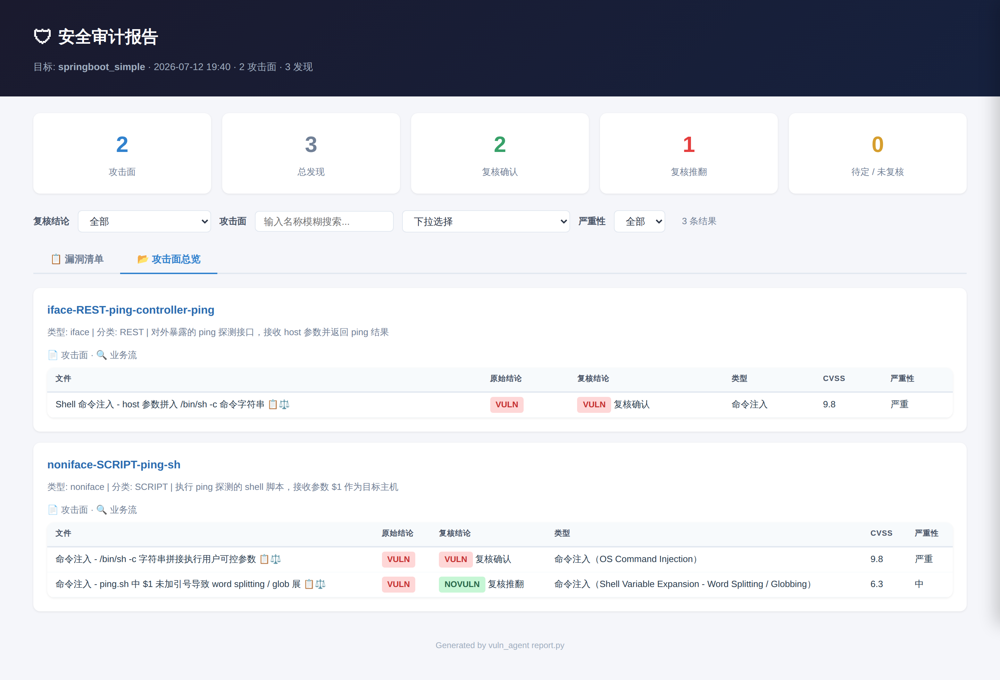

# vuln-agent

基于 LLM 的多阶段源码分析工具，从源码发现攻击面、追踪数据流、识别潜在漏洞并二次验证。

## 前置条件

依赖 `nga` 或 `opencode` CLI。

## 快速开始

对一个目标代码目录运行完整分析管道：

```bash
python3 run.py /path/to/target
```

无参数时显示帮助信息：

```bash
python3 run.py
```

## 工具使用建议

1. **先测试连通性** — 执行完整管道前先用 `--test` 确认 LLM 正常响应：

   ```bash
   python3 run.py --test
   python3 run.py --test --model w3/MiniMax-M2.7
   ```

   确认输出为模型自身名称后，直接执行完整分析：

   ```bash
   python3 run.py /path/to/target
   ```

2. **善用断点续跑** — 各阶段产物持久化在 `.vuln_agent_output/` 下，已完成的阶段不会重复执行。例如暴露面识别完成后退出，再次运行 `python3 run.py /target` 会自动跳过 `recon` 从 `flow` 继续。需重跑某阶段时用 `--stage` + `--overwrite`。

3. **提高暴露面识别精度** — `--recon-prompt` 可根据产品类型调整扫描焦点，减少无关噪声。默认扫描会收集所有类型入口（REST/MQ/CLI/脚本等），但不同产品的暴露面差异很大：

   - 纯 REST 后端 → 只需采集 Controller 接口，不应收集脚本
   - 数据处理管道 → 应重点关注 MQ 消费者和文件监听
   - CLI 工具 → 只应收集命令行入口

   通过 `--recon-prompt` 指定范围（如 `"只采集 REST 接口"`），能让识别更精准，提高后续分析效率。

## 命令行参数

```bash
python3 run.py [work_dir] [选项]
```

| 参数 | 说明 |
|------|------|
| `work_dir` | 目标代码目录（默认当前目录） |
| `--recon-prompt TEXT` | 暴露面识别阶段追加提示词 |
| `--flow-prompt TEXT` | 业务流分析阶段追加提示词 |
| `--vuln-prompt TEXT` | 漏洞分析阶段及后续复核阶段追加提示词 |
| `--thinking` | 显示 LLM 思考过程 |
| `--model MODEL` | 指定模型名称 |
| `--agent AGENT` | LLM 代理程序名称（`nga` 或 `opencode`），默认自动检测 |
| `--force-surface FILE` | 强制重新分析指定攻击面（逗号分隔，支持 `*` 通配），会清除已有产物 |
| `--stage {recon,flow,vuln,postprocess}` | 只运行单个阶段 |
| `--overwrite` | 与 `--stage` 搭配，删除该阶段已有产物后重新执行 |
| `--multi` | 多目标模式：将 `work_dir` 作为父目录，对其下每个子目录独立执行完整管道 |
| `--min-level {high,medium,low}` | 最低漏洞分析等级（默认 low，仅高优先级时设为 high 可加速） |
| `--test` | 测试 LLM 连通性（询问模型自身名称），不执行管道 |

### 示例

```bash
# 指定模型运行完整管道
python3 run.py /target --model w3/MiniMax-M2.7

# 暴露面识别阶段追加提示
python3 run.py /target --recon-prompt "从 /path/to/接口清单.xlsx 提取 REST 接口，不要扫描代码"

# 业务流分析阶段追加提示
python3 run.py /target --flow-prompt "重点分析参数校验逻辑"

# 漏洞分析阶段追加提示
python3 run.py /target --vuln-prompt "优先分析命令注入和路径穿越"

# 测试 LLM 连通性
python3 run.py --test
python3 run.py --test --model w3/MiniMax-M2.7

# 指定代理程序
python3 run.py /target --agent opencode

# 显示 LLM 思考过程
python3 run.py /target --thinking

# 强制重新分析特定攻击面
python3 run.py /target --force-surface "iface-upload-*"

# 只运行单个阶段
python3 run.py /target --stage recon          # 仅暴露面识别
python3 run.py /target --stage flow           # 仅业务流分析
python3 run.py /target --stage vuln           # 仅漏洞分析+复核
python3 run.py /target --stage postprocess    # 仅漏洞后置处理

# 覆盖重跑单个阶段（删除已有产物）
python3 run.py /target --stage recon --overwrite          # 重新收集暴露面
python3 run.py /target --stage flow --overwrite           # 重新分析业务流
python3 run.py /target --stage vuln --overwrite           # 重新漏洞分析+复核
python3 run.py /target --stage postprocess --overwrite    # 重新后置处理

# 多目标分析：父目录下的每个子目录独立执行完整管道
python3 run.py /parent --multi

# 多目标 + 指定模型
python3 run.py /parent --multi --model w3/MiniMax-M2.7

# 多目标 + 只跑某个阶段
python3 run.py /parent --multi --stage recon
```

## 输出产物

```
.vuln_agent_output/
├── discovered_surfaces/   # Stage 1 (surface_discover): 攻击面记录，每文件一个条目
├── analyzed_surfaces/     # Stage 2 (surface_analyze): 攻击面深度分析（含流程图、数据流追踪）
├── vuln_plans/            # Stage 2.5 (vuln_planner): 漏洞分析计划（按优先级分级）
├── vuln_findings/         # Stage 3 (vuln_analyze): 漏洞结论（VULN-/NOVULN-/SUSPECTED-）
├── vuln_reviews/          # Stage 3.5 (review_vuln): 二次审查结论（VULN-/NOVULN-/SUSPECTED-）
├── vuln_postprocess/      # Stage 4 (vuln_postprocess): 漏洞后置处理（用户自定义分析）
```

## 配置文件

`config/analysis-config.yaml` 用于控制管道行为：

```yaml
# 并发控制
max_workers: 3                   # 暴露面识别/分析阶段最大线程数
vuln_workers: 5                  # 漏洞分析阶段最大线程数

# 超时控制（分钟）
timeout_surface_discover: 120    # 暴露面识别超时
timeout_default: 60              # 其他阶段超时

# 阶段开关
decompile: false                 # 是否反编译 jar/war/class
bytecode_analysis: false         # 是否分析字节码
attack_surface_collection: true  # 是否收集攻击面
vulnerability_analysis: true     # 是否进行漏洞分析
vuln_re_analysis: false          # 是否对确认漏洞进行业务上下文复核
vuln_planning: true              # 是否启用漏洞分析规划
```

## 报告生成

管道运行完成后自动生成 HTML 审计报告，也可手动生成：

```bash
python3 reporting/report.py /path/to/target
```

报告文件输出到 `.vuln_agent_output/`：
- `report.html` — 静态模板（全屏布局，不含项目特有数据）
- `report-data.js` — 扫描数据（按 `<script src>` 加载，支持 `file://` 协议）
- `assets/` — 静态资源（marked / highlight / mermaid / GitHub 样式）

多目标收集：
```bash
python3 collect.py /path/to/target1 /path/to/target2
# 支持通配符：展开指定目录下的所有子目录
python3 collect.py /path/to/parent/*
```
收集到 `reporting/collected/`，通过 `reporting/dashboard.html` 查看。多个目标时默认合并显示。

功能：
- **📋 漏洞清单** — 汇总卡片 + 可筛选表格（按复核结论 / 攻击面模糊搜索+精确下拉 / 严重性）
- **📂 攻击面总览** — 按攻击面分组展示，含子表格和文件链接
- **📄 文件预览** — 点击文件图标打开右侧抽屉，渲染 Markdown / 代码高亮 / Mermaid 图表
- **🔄 关闭抽屉后保持行高亮** — 便于继续操作该行的其他按钮
- **👁️ 已查看文件图标淡化** — 通过 localStorage 持久化，跨页面刷新保持







## 示例产物

`<分析目标>/.vuln_agent_output` 目录包含各阶段产出的示例文件，可点击查看：

- [Stage 1 攻击面识别](docs/surfaces/iface-REST-ping.md)
- [Stage 2 攻击面分析](docs/analysis/iface-REST-ping.md)
- [Stage 3 漏洞结论](docs/vulnerabilities/VULN-iface-REST-ping-1-1.md)
- [Stage 4 二次审查](docs/vuln_review/VULN-VULN-iface-REST-ping-1-1.md)


