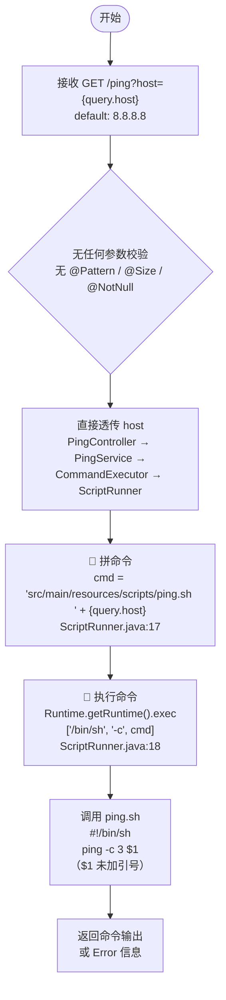

# GET /ping — 系统 ping 健康检查

- **类型**：iface
- **分类**：REST
- **来源**：src/main/java/com/example/demo/controller/PingController.java:18
- **URL**：GET /ping
- **方法**：ping()
- **参数**：query: `host` (default: `"8.8.8.8"`)

## 请求

| 维度 | 详情 |
|------|------|
| path | `/ping` |
| query | `host` (default: `"8.8.8.8"`) |
| header | 无关 |
| body | 无 |

入参 `host` 上无任何注解式校验（无 `@NotNull`、`@Size`、`@Pattern`、`@Valid`）。

```java
// src/main/java/com/example/demo/controller/PingController.java:17-20
@GetMapping("/ping")
public String ping(@RequestParam(defaultValue = "8.8.8.8") String host) {
    return pingService.ping(host);
}
```

## 调用链

```
PingController.ping(host)
  → PingService.ping(host)                          [interface]
    → PingServiceImpl.ping(host)                    [impl]
      → CommandExecutor.execute(host)               [util]
        → ScriptRunner.run(host)                    [核心：命令构建+执行]
```

### PingServiceImpl

```java
// src/main/java/com/example/demo/service/impl/PingServiceImpl.java:17-19
@Override
public String ping(String host) {
    return commandExecutor.execute(host);
}
```

### CommandExecutor

```java
// src/main/java/com/example/demo/util/CommandExecutor.java:14-16
public String execute(String host) {
    return scriptRunner.run(host);
}
```

### ScriptRunner — 命令构建与执行

```java
// src/main/java/com/example/demo/util/ScriptRunner.java:11-28
@Value("${ping.script.path}")
private String scriptPath;

public String run(String host) {
    StringBuilder result = new StringBuilder();
    try {
        String cmd = scriptPath + " " + host;
        Process process = Runtime.getRuntime().exec(new String[]{"/bin/sh", "-c", cmd});
        BufferedReader reader = new BufferedReader(new InputStreamReader(process.getInputStream()));
        String line;
        while ((line = reader.readLine()) != null) {
            result.append(line).append("\n");
        }
        process.waitFor();
    } catch (Exception e) {
        result.append("Error: ").append(e.getMessage());
    }
    return result.toString();
}
```

`scriptPath` 来自配置文件：

```yaml
# src/main/resources/application.yml:2-3
ping:
  script:
    path: src/main/resources/scripts/ping.sh
```

## 关键控制点

### 1. 入参校验

- **做了什么**：无。`host` 参数仅声明了 `defaultValue = "8.8.8.8"`，无任何约束校验注解。
- **没做什么**：未做格式校验（是否为合法 IP/域名）、未做长度校验、未做字符黑/白名单过滤、未做主机名可达性预检。

### 2. 命令执行

- **做了什么**：通过 `/bin/sh -c` 执行拼接后的命令字符串 `src/main/resources/scripts/ping.sh {host}`。
- **没做什么**：未使用参数化命令构造（如 `ProcessBuilder` 列表形式传参），未对 `host` 做 shell 元字符转义，未限制命令白名单。`host` 完全由用户控制，直接拼接到 shell 命令中。

### 3. 脚本内容

```bash
# src/main/resources/scripts/ping.sh
#!/bin/sh
ping -c 3 $1
```

`$1` 未加引号，在 shell 展开后存在单词拆分和通配符扩展。

## 入参流向

`host`（query 参数）经 `PingController → PingService → CommandExecutor → ScriptRunner` 四层传递，最终拼入 shell 命令字符串：

```
cmd = "src/main/resources/scripts/ping.sh " + host
```

最终执行：`/bin/sh -c "src/main/resources/scripts/ping.sh {host}"`

## 流程图



## 未能追溯的引用

- 无
