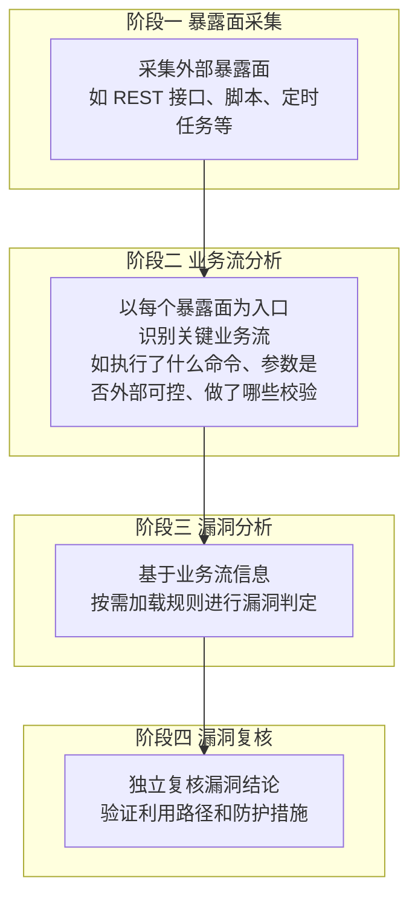
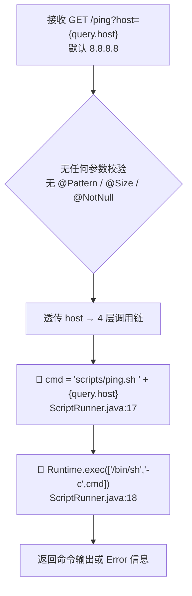
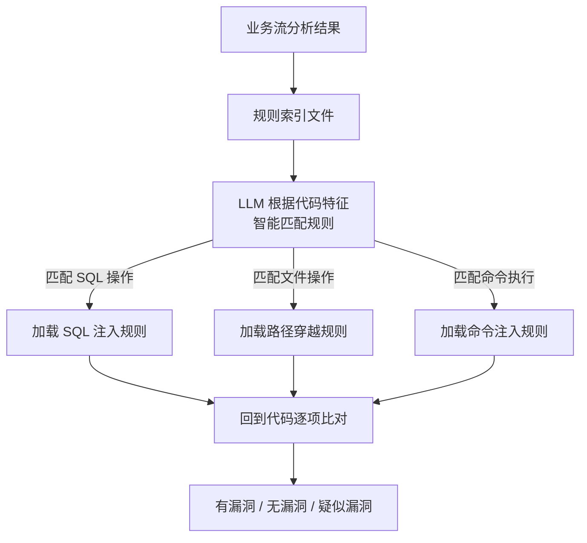
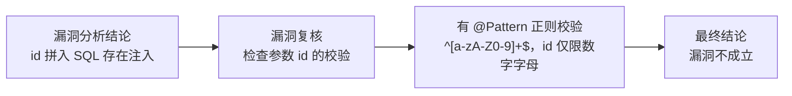

# vuln-agent

AI 多智能体静态漏洞挖掘工具。

---

## 整体流程



---


### 暴露面采集

> 只做暴露面识别，不做深入分析。

扫描代码仓库，识别所有外部可达的入口，包括：

| iface | noniface |
|-------|----------|
| REST 接口（URL、函数入口、代码行号） | 独立脚本工具 |
| MQ 消费者 | 定时任务 |
| gRPC、WebSocket 等 | CLI 命令入口 |

每个条目记录入口类型、精确位置、URL、参数等关键信息。

---

### 业务流分析

> 陈述事实，不下安全结论。

对每个入口点分析其业务逻辑——接收什么参数、经过哪些处理环节、最终操作什么数据。同时从安全视角标注关键控制点，如路径拼接、命令执行、SQL 查询、敏感信息日志等。

产出物是包含**请求表 + 调用链 + 关键控制点 + 入参流向 + 流程图**的分析报告：

#### 请求表

| 维度 | 详情 |
|------|------|
| path | `/ping` |
| query | `host` (default: `"8.8.8.8"`, 无校验) |
| header | 无关 |
| body | 无 |

#### 调用链

入参 `host` 经 4 层传递直达命令执行：

```
PingController.ping(host)
  → PingService.ping(host)
    → PingServiceImpl.ping(host)
      → CommandExecutor.execute(host)
        → ScriptRunner.run(host)   ← 命令拼接 + Runtime.exec
```

#### 关键控制点

```java
// ScriptRunner.java:17-18
String cmd = scriptPath + " " + host;
Process process = Runtime.getRuntime().exec(new String[]{"/bin/sh", "-c", cmd});
```

```bash
# ping.sh:2 — $1 未加引号，存在单词拆分
ping -c 3 $1
```

#### 流程图



---

### 漏洞分析

> 根据业务流分析结果，按匹配的场景动态加载规则，无论结果如何均需给出详细分析过程和举证信息。



---

### 漏洞复核

> 挑战者姿态复核漏洞

例如漏洞分析判定参数 `id` 拼入 `SELECT * FROM users WHERE id = ${id}` 存在 SQL 注入，漏洞复核检查发现参数有 `@Pattern(regexp = "^[a-zA-Z0-9]+$")` 校验，id 仅限数字字母，结论为漏洞不成立。


